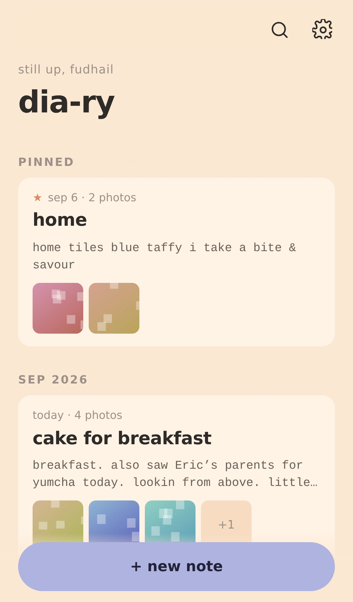

# dia-ry

A calm photo diary that installs on an iPhone home screen. Plain HTML, CSS and
JavaScript — no framework, no build step, no server, no account. Everything you
write stays in the browser's own database on the device.



## What it does

- **Notebooks.** A shelf of notebooks, each with its own cover, for the
  different corners of a life — a trip, a book log, a place to think. Covers
  are drawn as SVG (six designs × six colourways), so they weigh nothing and
  stay sharp at any size.
- **Notes and entries.** A note is a page inside a notebook (a day, a place, a
  mood). Inside it, entries stack up on a timeline with the time in the left
  margin, photos above their words, exactly like a paper diary.
- **Write in one tap.** The home button drops you straight into today's page,
  making it if it does not exist yet. A page with no title wears its date
  instead, so nothing has to be named.
- **On this day.** A quiet line on home for what you wrote on this date in
  earlier years.
- **Undo.** Deleting a note or an entry offers eight seconds of undo, photos
  and all.
- **Photos.** The shutter opens the camera, the side button your library. Pick
  as many as you like per entry. They are compressed on the
  device (1800px long edge) with a separate thumbnail, so scrolling stays fast
  and years of photos still fit.
- **Rich text.** Bold, italic, underline, strikethrough, highlight, bullets and
  quotes. Pasted text comes in clean.
- **Search** across every notebook, title, place and word you have written.
- **Themes.** Six palettes, light / dark / follow-system, and a text-size slider.
- **Offline.** Works with no signal once installed.
- **Updates itself.** A new deploy is picked up the next time the app is
  opened — no reinstall, no clearing anything.
- **Backups.** One tap produces a `.zip` holding `diary.json` plus every photo
  as an ordinary `.jpg`. On iPhone it opens the share sheet, so *Save to Files*
  puts it in iCloud Drive. Restore merges or replaces.

## Install on iPhone

1. Host the folder over HTTPS (see below) and open the URL in **Safari**.
2. Tap the share button → **Add to Home Screen**.
3. Open it from the home screen. It runs full screen with no browser chrome.

Safari is required for the install step — Chrome on iOS cannot add PWAs.

## Hosting

Any static host works; there is nothing to build.

**GitHub Pages** — push to `main` and the included workflow
(`.github/workflows/pages.yml`) publishes the site. Enable it once under
*Settings → Pages → Source: GitHub Actions*.

**Locally** — `npx http-server -p 8080 .` then open `http://localhost:8080`.
Service workers need HTTPS or `localhost`.

## Shipping an update

1. Make the change.
2. Bump `VERSION` in `sw.js` (`'1.0.0'` → `'1.0.1'`). That renames the cache,
   which is the whole trigger. **An unchanged `VERSION` means installed phones
   keep serving the old files.**
3. Push. GitHub Pages redeploys.

On the phone, nothing needs doing. Next time the app is opened it byte-checks
`sw.js` against the server, downloads the new shell in the background, swaps it
in and reloads once — usually before you have finished reading the home screen.
A brief "updating dia-ry…" is the only sign of it.

It will not reload while a sheet is open or an entry is half-written; it waits
until you are done. Notes, entries and photos live in IndexedDB and are never
touched by an update. *Settings → app* shows the running version and can force
a check.

## Where your diary lives

IndexedDB, in the browser, on that one device. Nothing is uploaded anywhere.

That also means: **nothing is backed up for you.** Two things to know if you
plan to keep this for years.

1. Run **Settings → back up to a zip file** now and then and send it somewhere
   else — the iPhone share sheet offers *Save to Files* → iCloud Drive. The app
   nudges you monthly. (Building the zip can use up the tap Safari allows for
   sharing; when that happens the row turns into **save your backup** and one
   more tap sends it.)
2. Deleting the app from the home screen, or "Clear website data" in Safari,
   erases the diary. The app asks iOS to mark its storage persistent, which
   protects it from routine eviction, but not from a deliberate wipe.

A backup zip is readable without this app: `diary.json` is plain text and the
photos are normal JPEGs.

## Project layout

```
index.html              app shell, all screens
css/app.css             themes + layout (every colour is a token)
js/db.js                IndexedDB open/transaction helpers + migrations
js/store.js             notebooks, notes, entries, photos, settings
js/covers.js            notebook covers, drawn as SVG
js/images.js            downscale + compress on the device
js/zip.js               hand-written ZIP reader/writer
js/backup.js            export / restore
js/ui.js                sheets, toast, lightbox
js/views/               shelf, home (a notebook), note, composer, settings
sw.js                   offline shell cache + VERSION
js/update.js            picks up new versions and reloads when it is safe
icons/source.png        the icon artwork everything else is built from
scripts/make-icons.mjs  rebuilds icons/ from source.png (needs a Chromium)
```

## Keeping it working for years

- The database schema is **versioned and additive only** — `js/db.js` must never
  drop or repurpose an existing store, so an old diary always opens. Version 2
  added notebooks and moved every existing note onto a default shelf; a
  version-1 database still opens and migrates itself on first launch.
- Backup files carry a `format` number. A newer backup is refused by an older
  app rather than half-imported, and an older one (format 1, before notebooks)
  restores onto the default shelf.
- There are no dependencies to rot. The only tooling is Node, and only for
  regenerating icons.
- After changing any shell file, bump `VERSION` in `sw.js` (see below), so
  installed copies pick the change up.
